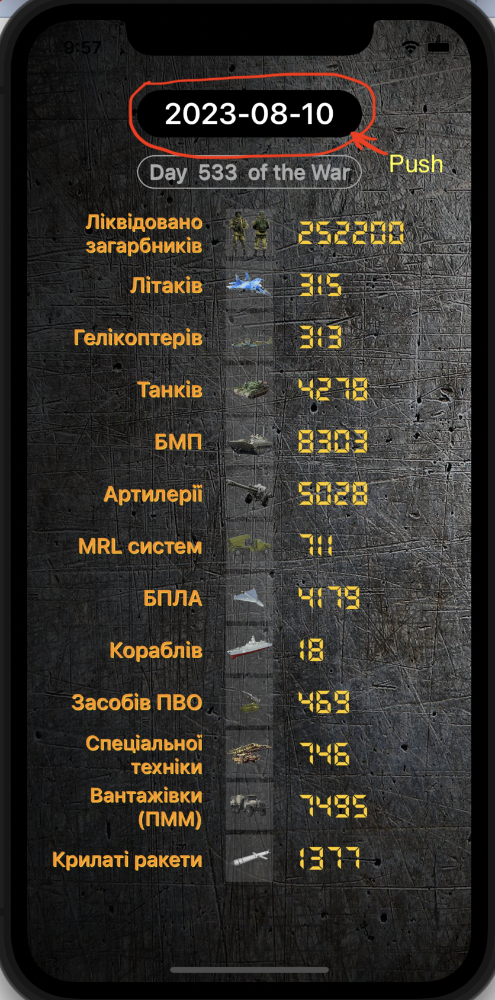
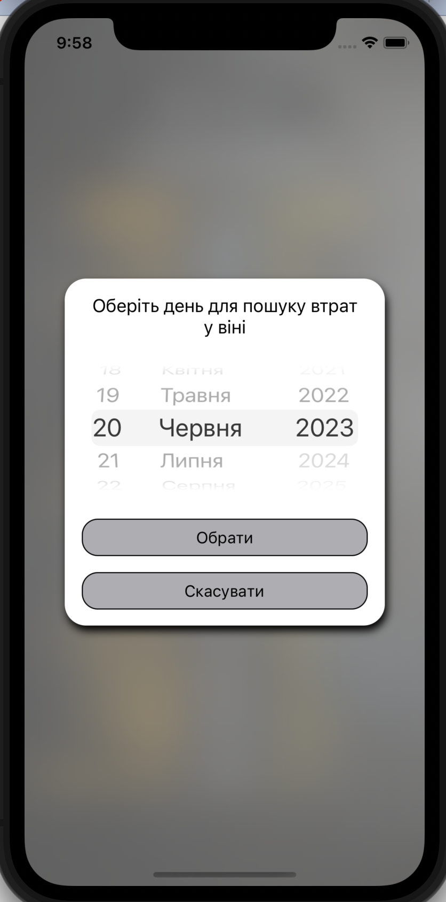
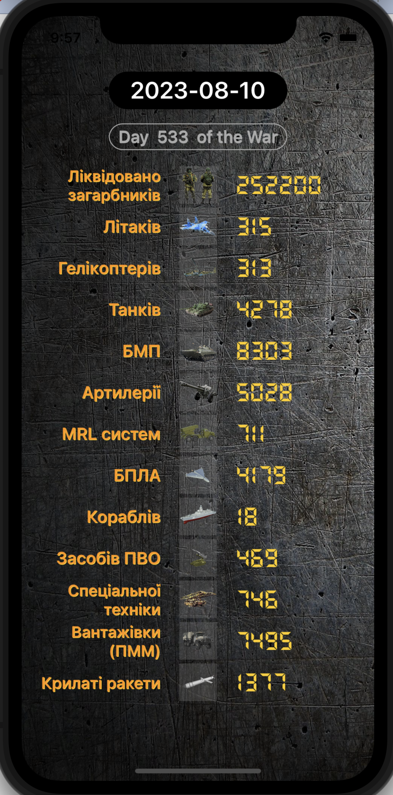
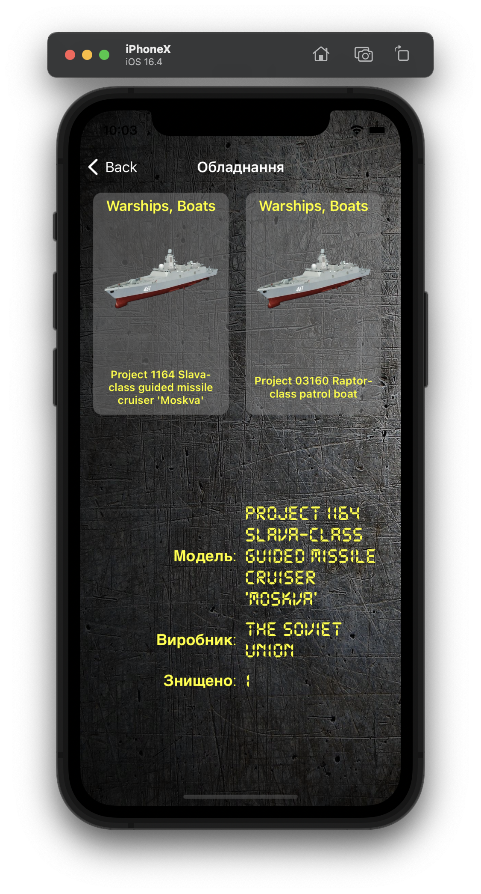

# War Statistics
Program for viewing statistics of enemy losses in equipment and manpower.
The user has the ability to choose the date the statistics are displayed.

## Content
- [Technologies](#technologies)
- [Additionally](#additionally)
- [Screenshots](#screenshots)
- [Contributing](#contributing)

## Technologies
- Swift
- UIKit
- Code-only layout
- Auto Layout
- WebKit
- MVC
- Without storyboard
- JSON 
- Table and CollectionViews

## Additionally
As an addition, the ability to select the date for displaying statistics has been added. To do this, click on the date on the first screen at the top of the screen. (as in the screenshot below)

 

## Screenshots:

  

## Contributing
If you find a bug or remark in the code or when the program is running, please email me:
<a href="mailto:olga.sabadina@icloud.com">olga.sabadina@icloud.com</a>

### Why did I write this project?
___
There is a war going on in our country and every loss of an enemy brings our victory closer.
I wrote this project with the help of the knowledge gained during the course on [Foxminded](https://foxminded.ua) по Swift

